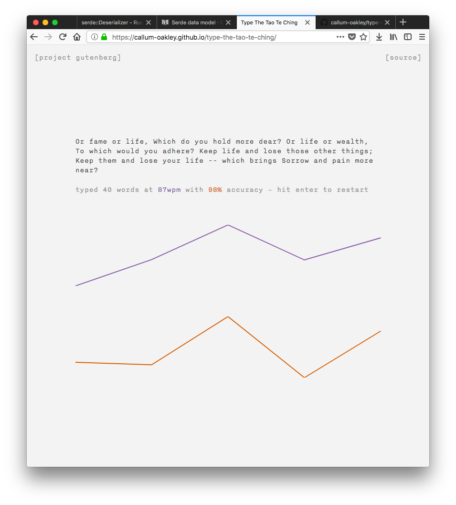

# Type The Tao Te Ching

A typing practice app aiming for a simple interface. Featuring passages from
the Tao Te Ching ([courtesy of Project Gutenberg][0]) and powered by
[Hyperapp][1].

## Use

Type through the greyed out passage. Errors are highlighted in red and *must be
corrected*. A WMP and accuracy score will be displayed upon completion along
with basic graphs of historical scores.

## Build locally

Clone this repository and then:

    yarn
    yarn lint:build

Passages are randomly selected from `src/texts.json`. To populate this file
with paragraphs from a text file, run

    yarn process-text texts/your-file.txt

The processing is pretty rough, and the resulting JSON file will require some
manual attention, but it&rsquo;s a good place to start.

[0]: http://www.gutenberg.org/ebooks/216
[1]: https://hyperapp.js.org/

## Deploy

Deploy to the `build` folder to github pages with

    yarn deploy
